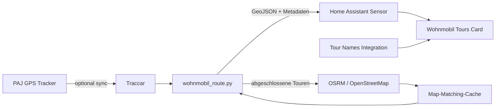

# Wohnmobil-Touren für Home Assistant

Home-Assistant-Projekt zur automatischen Erkennung, Auswertung und Darstellung von Wohnmobil-Touren aus GPS-Daten in Traccar.

Die Lösung trennt Reisen anhand bestätigter Aufenthalte im Heimatbereich, behält die ersten und letzten Kilometer innerhalb des Heimat-Radius in der sichtbaren Tour, berechnet GPS-Strecken und kann abgeschlossene Touren einmalig per OSRM/OpenStreetMap auf das Straßennetz matchen. Eine eigene Lovelace-Karte zeigt bis zu 50 Touren farbig an und erlaubt das dauerhafte Umbenennen von Touren.

> **Datenschutz:** Dieses Repository enthält absichtlich keine echten Zugangsdaten, Tracker-IDs, internen IP-Adressen oder Heimatkoordinaten. Alle installationseigenen Werte gehören ausschließlich in `wohnmobil_tours.private.json`, das durch `.gitignore` ausgeschlossen ist.

## Funktionen

- Traccar als zentrale GPS-Datenquelle
- optionaler PAJ-GPS → Traccar-Synchronisierer
- Tour-Erkennung zwischen bestätigten Heimataufenthalten
- konfigurierbarer Heimat-Radius, standardmäßig 20 km
- zusätzliche stationäre Bestätigung, damit Fahrten innerhalb des Heimatbereichs nicht als Tourende gelten
- erste und letzte Kilometer innerhalb des Heimat-Radius bleiben Bestandteil der Tour
- aktive und abgeschlossene Touren
- bis zu 50 Touren als GeoJSON-Attribute in Home Assistant
- 20 automatisch wiederholte Tourfarben
- GPS-Distanz für jede Tour
- einmaliges Map Matching abgeschlossener Touren über OSRM/OpenStreetMap
- persistenter Map-Matching-Cache
- Plausibilitätsprüfung zwischen GPS- und Straßenstrecke
- dynamische Leaflet-Lovelace-Karte
- Auswahl einzelner Touren oder Gesamtansicht
- optionale Anzeige der aktuellen Fahrzeugposition
- persistente, zentral in Home Assistant gespeicherte Tournamen
- keine Python-Fremdpakete für die Skripte erforderlich

## Architektur



## Verzeichnisstruktur

```text
.
├── config/
│   └── wohnmobil_tours.example.json
├── docs/
│   ├── ARCHITECTURE.md
│   ├── CONFIGURATION.md
│   ├── INSTALLATION.md
│   ├── MAP_MATCHING.md
│   └── TROUBLESHOOTING.md
├── homeassistant/
│   ├── custom_components/wohnmobil_tour_names/
│   └── packages/wohnmobil_tours.yaml
├── lovelace/
│   └── wohnmobil-tours-card.yaml
├── scripts/
│   ├── check_public_repo.py
│   ├── paj_sync_to_traccar.py
│   └── wohnmobil_route.py
├── tests/
│   └── test_route_logic.py
└── www/
    └── wohnmobil-tours-card.js
```

## Schnellinstallation

1. Repository herunterladen oder klonen.
2. `scripts/wohnmobil_route.py` nach `/config/scripts/` kopieren.
3. Optional `scripts/paj_sync_to_traccar.py` ebenfalls nach `/config/scripts/` kopieren.
4. `www/wohnmobil-tours-card.js` nach `/config/www/` kopieren.
5. `homeassistant/custom_components/wohnmobil_tour_names/` nach `/config/custom_components/wohnmobil_tour_names/` kopieren.
6. `homeassistant/packages/wohnmobil_tours.yaml` nach `/config/packages/` kopieren.
7. `config/wohnmobil_tours.example.json` nach `/config/wohnmobil_tours.private.json` kopieren und **nur lokal** mit den eigenen Werten füllen.
8. Falls noch nicht vorhanden, Packages in `configuration.yaml` aktivieren:

```yaml
homeassistant:
  packages: !include_dir_named packages
```

9. Home-Assistant-Konfiguration prüfen und Home Assistant neu starten.
10. In **Einstellungen → Dashboards → Ressourcen** `/local/wohnmobil-tours-card.js` als **JavaScript-Modul** eintragen.
11. Die Karte aus `lovelace/wohnmobil-tours-card.yaml` in ein Dashboard übernehmen.

Die ausführliche Anleitung steht in [docs/INSTALLATION.md](docs/INSTALLATION.md).

## Manuell aktualisieren

In Home Assistant unter **Entwicklerwerkzeuge → Aktionen**:

```yaml
action: homeassistant.update_entity
target:
  entity_id: sensor.wohnmobil_gesamtroute
```

Beim ersten Lauf werden abgeschlossene, noch nicht gecachte Touren automatisch gematcht, sofern Map Matching aktiviert ist.

## Private Konfiguration

Die Vorlage liegt unter `config/wohnmobil_tours.example.json`. Die produktive Datei muss lokal als

```text
/config/wohnmobil_tours.private.json
```

angelegt werden.

Beispielbereiche:

- `traccar`: API-Adresse, interne Device-ID und Login
- `tour_detection`: Heimatkoordinaten und Tour-Trennparameter
- `map_matching`: OSRM-Parameter und Cache-Datei
- `paj`: optionaler PAJ-Login und Tracker-ID
- `traccar_ingest`: optionales OsmAnd-Ziel für den PAJ-Sync

**Die private Datei niemals committen.**

## Map Matching

Map Matching wird nur für abgeschlossene Touren ausgeführt. Erfolgreiche Ergebnisse werden dauerhaft gespeichert und bei späteren Sensor-Aktualisierungen wiederverwendet. Dadurch wird der öffentliche OSRM-Dienst nicht bei jeder Home-Assistant-Aktualisierung erneut belastet.

Mehr dazu: [docs/MAP_MATCHING.md](docs/MAP_MATCHING.md).

## PAJ-GPS-Synchronisierung

Der PAJ-Sync ist optional. Das Skript verwendet Web-API-Endpunkte, die nicht als stabile öffentliche PAJ-API zugesichert sind. Änderungen auf PAJ-Seite können daher Anpassungen erforderlich machen.

Wenn die GPS-Daten bereits auf anderem Weg in Traccar ankommen, kann `paj.enabled` auf `false` bleiben.

## Sicherheit

Vor jedem Push kann geprüft werden, ob versehentlich private Dateien, Zugangsdaten oder typische lokale IP-Adressen in den Repository-Inhalt geraten sind:

```bash
python3 scripts/check_public_repo.py .
```

Siehe außerdem [SECURITY.md](SECURITY.md).

## Technische Hinweise

Die Home-Assistant-Integration `command_line` kann JSON-Ausgabe eines Skripts als Sensorzustand und JSON-Attribute übernehmen. Die mitgelieferte Package-Datei nutzt dieses Verfahren. Die Custom Card wird als JavaScript-Modul aus `/config/www/` geladen.

Die Skripte verwenden ausschließlich die Python-Standardbibliothek. Für das Frontend wird Leaflet 1.9.4 zur Laufzeit geladen.

## Lizenz

MIT – siehe [LICENSE](LICENSE).
